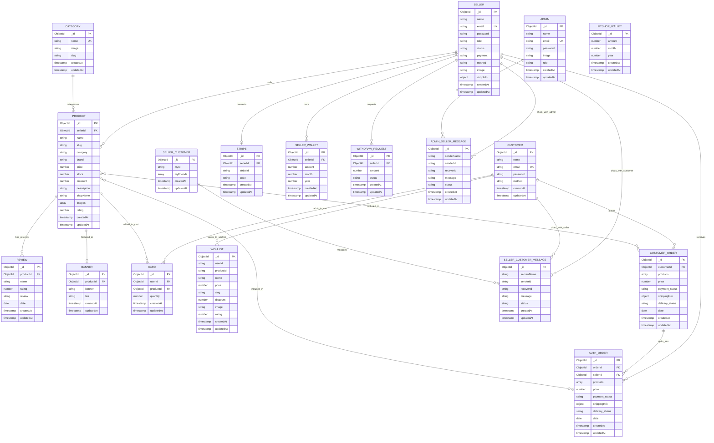

# VendorVerse - Entity Relationship Diagram

## Database Schema Overview

This ER diagram represents the complete database structure of VendorVerse, a multi-vendor e-commerce platform with 18 models organized into 6 functional groups.

---

## Mermaid ER Diagram

---

## Entity Descriptions

### User Management Group

#### 1. ADMIN
- **Purpose**: System administrators who manage the entire platform
- **Key Fields**: name, email, password (hashed), role
- **Relationships**:
  - Has many Admin-Seller Messages

#### 2. SELLER (Vendor)
- **Purpose**: Vendors who sell products on the platform
- **Key Fields**: name, email, status (pending/active/deactive), payment (inactive/active), shopInfo
- **Relationships**:
  - Has many Products
  - Has many Auth Orders
  - Has many Seller Wallet entries
  - Has one Stripe account
  - Has many Withdraw Requests
  - Has many Messages (with admin and customers)
- **Business Rule**: Status must be 'active' and payment 'active' to receive payments

#### 3. CUSTOMER
- **Purpose**: End users who purchase products
- **Key Fields**: name, email, password (hashed)
- **Relationships**:
  - Has many Customer Orders
  - Has many Cart items
  - Has many Wishlist items
  - Has many Messages with sellers

---

### Product & Catalog Group

#### 4. CATEGORY
- **Purpose**: Product categorization
- **Key Fields**: name (unique), slug, image
- **Relationships**:
  - Has many Products
- **Indexes**: Text index on name for search

#### 5. PRODUCT
- **Purpose**: Products listed by sellers
- **Key Fields**: name, slug, price, stock, discount, rating, images (array), sellerId
- **Relationships**:
  - Belongs to one Seller
  - Belongs to one Category
  - Has many Reviews
  - Has many Cart items
  - Has one Banner (optional)
- **Indexes**: Weighted text search on name (5), category (4), brand (3), description (2)

#### 6. REVIEW
- **Purpose**: Customer product reviews and ratings
- **Key Fields**: productId, name, rating (1-5), review text, date
- **Relationships**:
  - Belongs to one Product

#### 7. BANNER
- **Purpose**: Promotional banners for featured products
- **Key Fields**: productId, banner (image URL), link
- **Relationships**:
  - Belongs to one Product

---

### Shopping Cart & Wishlist Group

#### 8. CARD (Shopping Cart)
- **Purpose**: Shopping cart items
- **Key Fields**: userId, productId, quantity
- **Relationships**:
  - Belongs to one Customer
  - Belongs to one Product

#### 9. WISHLIST
- **Purpose**: Customer favorites/saved items
- **Key Fields**: userId, productId, name, price, image, rating
- **Relationships**:
  - Belongs to one Customer
- **Note**: Denormalized data for faster retrieval

---

### Order Management Group

#### 10. CUSTOMER_ORDER
- **Purpose**: Main customer orders
- **Key Fields**: customerId, products (array), price, payment_status, delivery_status, shippingInfo
- **Relationships**:
  - Belongs to one Customer
  - Has many Auth Orders (split by seller)
  - Contains many Products
- **Statuses**:
  - payment_status: 'paid' | 'unpaid'
  - delivery_status: 'pending' | 'processing' | 'shipped' | 'delivered' | 'cancelled'

#### 11. AUTH_ORDER
- **Purpose**: Individual seller order segments
- **Key Fields**: orderId (link to customer order), sellerId, products, price, payment_status, delivery_status
- **Relationships**:
  - Belongs to one Customer Order
  - Belongs to one Seller
  - Contains many Products (for that seller)
- **Business Rule**: Created by splitting customer order by seller

---

### Payment & Financial Group

#### 12. STRIPE
- **Purpose**: Stripe Connect account information
- **Key Fields**: sellerId, stripeId (Stripe account ID), code (activation code)
- **Relationships**:
  - Belongs to one Seller
- **Business Rule**: Required for sellers to receive payments

#### 13. SELLER_WALLET
- **Purpose**: Track seller earnings by month/year
- **Key Fields**: sellerId, amount, month, year
- **Relationships**:
  - Belongs to one Seller
- **Business Rule**: Aggregated monthly for reporting

#### 14. MYSHOP_WALLET
- **Purpose**: Platform/admin revenue tracking
- **Key Fields**: amount, month, year
- **Business Rule**: Platform fee collected from each order

#### 15. WITHDRAW_REQUEST
- **Purpose**: Seller withdrawal requests
- **Key Fields**: sellerId, amount, status (pending/approved/rejected)
- **Relationships**:
  - Belongs to one Seller
- **Workflow**: pending → admin reviews → approved/rejected

---

### Messaging Group

#### 16. ADMIN_SELLER_MESSAGE
- **Purpose**: Chat messages between admin and sellers
- **Key Fields**: senderName, senderId, receverId, message, status (seen/unseen)
- **Relationships**:
  - References Admin and Seller

#### 17. SELLER_CUSTOMER_MESSAGE
- **Purpose**: Chat messages between sellers and customers
- **Key Fields**: senderName, senderId, receverId, message, status (seen/unseen)
- **Relationships**:
  - References Seller and Customer

#### 18. SELLER_CUSTOMER (Chat Relationship)
- **Purpose**: Track chat relationships
- **Key Fields**: myId, myFriends (array of IDs)
- **Business Rule**: Manages who can chat with whom

---

## Key Relationships Summary

### One-to-Many (1:M)
- Seller → Products
- Seller → Auth Orders
- Seller → Seller Wallet
- Seller → Withdraw Requests
- Customer → Customer Orders
- Customer → Cart Items
- Customer → Wishlist Items
- Category → Products
- Product → Reviews
- Customer Order → Auth Orders (split)

### One-to-One (1:1)
- Seller → Stripe Account
- Product → Banner (optional)

### Many-to-Many (M:N)
- Products ↔ Customer Orders (through products array)
- Products ↔ Auth Orders (through products array)

---

## Database Indexes

### Text Search Indexes
1. **SELLER**: name, email
2. **CATEGORY**: name
3. **PRODUCT**: name (weight: 5), category (weight: 4), brand (weight: 3), description (weight: 2)

### Unique Indexes
1. **ADMIN**: email
2. **SELLER**: email
3. **CUSTOMER**: email
4. **CATEGORY**: name

---

## Cardinality Notation

- `||--o{` : One to Many (One mandatory, Many optional)
- `||--o|` : One to One (Both optional)
- `}o--o{` : Many to Many

---

## How to View This Diagram

1. **Online Mermaid Editors**:
   - https://mermaid.live/
   - Copy the mermaid code block and paste it there

2. **VS Code**:
   - Install "Markdown Preview Mermaid Support" extension
   - Preview this markdown file

3. **GitHub**:
   - GitHub automatically renders Mermaid diagrams in markdown files

4. **Export Options**:
   - Use mermaid.live to export as PNG, SVG, or PDF
   - Use for PowerPoint presentations

---

## Database Statistics

- **Total Models**: 18
- **User-related Models**: 3 (Admin, Seller, Customer)
- **Product-related Models**: 4 (Category, Product, Review, Banner)
- **Shopping Models**: 2 (Cart, Wishlist)
- **Order Models**: 2 (Customer Order, Auth Order)
- **Payment Models**: 4 (Stripe, Seller Wallet, MyShop Wallet, Withdraw Request)
- **Chat Models**: 3 (Admin-Seller Message, Seller-Customer Message, Seller-Customer)

---

**Generated for VendorVerse Final Semester Project Presentation**
