# VendorVerse - User Flow Diagrams

This document contains complete user journey flows for all three user types in the VendorVerse platform.

---

## 1. CUSTOMER USER FLOW

### Customer Complete Journey

---

## 2. SELLER (VENDOR) USER FLOW

### Seller Complete Journey

---

## 3. ADMIN USER FLOW

### Admin Complete Journey

```mermaid
flowchart TD
    Start([Admin Logs In]) --> Login[Admin Login<br/>POST /api/admin-login]

    Login --> TokenStored[JWT Token Stored<br/>7 days expiry]

    TokenStored --> Dashboard[Admin Dashboard<br/>GET /api/admin/get-dashboard-data]

    Dashboard --> DashboardView[View Platform Analytics<br/>- Total Sales Revenue<br/>- Total Products<br/>- Total Sellers<br/>- Total Orders<br/>- Monthly Sales Chart<br/>- Recent Orders]

    DashboardView --> AdminActions{Admin Actions}

    AdminActions -->|Manage Sellers| SellerManagement
    AdminActions -->|Manage Categories| CategoryManagement
    AdminActions -->|Monitor Orders| OrderManagement
    AdminActions -->|Payment Requests| PaymentManagement
    AdminActions -->|Seller Support| SellerChat

    %% Seller Management Flow
    SellerManagement --> SellerActions{Seller Actions}

    SellerActions -->|Pending Requests| ViewRequests[View Seller Requests<br/>GET /api/request-seller-get]
    SellerActions -->|Active Sellers| ViewActiveSellers[View Active Sellers<br/>GET /api/get-sellers]
    SellerActions -->|Deactive Sellers| ViewDeactiveSellers[View Deactive Sellers<br/>GET /api/get-deactive-sellers]

    ViewRequests --> RequestList[Seller Request List<br/>Status: Pending]

    RequestList --> SelectSeller[Select Seller<br/>GET /api/get-seller/:sellerId]

    SelectSeller --> ReviewSeller[Review Seller Details<br/>- Name, Email<br/>- Shop Info<br/>- Registration Date]

    ReviewSeller --> Decision{Approve or Reject?}

    Decision -->|Approve| ApproveSeller[Approve Seller<br/>POST /api/seller-status-update<br/>Status: Active]
    Decision -->|Reject| RejectSeller[Reject Seller<br/>POST /api/seller-status-update<br/>Status: Deactive]

    ApproveSeller --> SellerActive[Seller Can Access Platform<br/>Email Notification Sent]
    RejectSeller --> SellerRejected[Seller Blocked<br/>Cannot Access Platform]

    SellerActive --> Dashboard
    SellerRejected --> Dashboard

    ViewActiveSellers --> ActiveList[Active Seller List<br/>View Performance Metrics]
    ActiveList --> SellerDetails[View Seller Details<br/>- Products Count<br/>- Total Sales<br/>- Order Count]
    SellerDetails --> ManageStatus{Change Status?}
    ManageStatus -->|Yes| DeactivateSeller[Deactivate Seller<br/>POST /api/seller-status-update]
    ManageStatus -->|No| Dashboard
    DeactivateSeller --> Dashboard

    ViewDeactiveSellers --> DeactiveList[Deactive Seller List]
    DeactiveList --> ReactivateOption{Reactivate?}
    ReactivateOption -->|Yes| ReactivateSeller[Reactivate Seller<br/>POST /api/seller-status-update]
    ReactivateOption -->|No| Dashboard
    ReactivateSeller --> Dashboard

    %% Category Management Flow
    CategoryManagement --> CategoryActions{Category Actions}

    CategoryActions -->|Add Category| AddCategory[Add New Category<br/>POST /api/category-add]
    CategoryActions -->|View Categories| ViewCategories[View All Categories<br/>GET /api/category-get]
    CategoryActions -->|Edit Category| EditCategory[Edit Category<br/>PUT /api/category-update/:id]
    CategoryActions -->|Delete Category| DeleteCategory[Delete Category<br/>DELETE /api/category/:id]

    AddCategory --> CategoryForm[Fill Category Form<br/>- Category Name<br/>- Upload Image Cloudinary<br/>- Generate Slug]

    CategoryForm --> CategoryCreated[Category Created<br/>Available for Products]
    CategoryCreated --> Dashboard

    ViewCategories --> CategoryList[Category List<br/>With Product Counts]
    CategoryList --> CategoryActions

    EditCategory --> UpdateCategory[Update Category Details<br/>Name, Image, Slug]
    UpdateCategory --> CategoryUpdated[Category Updated<br/>All Products Updated]
    CategoryUpdated --> Dashboard

    DeleteCategory --> ConfirmDelete{Confirm Delete?}
    ConfirmDelete -->|Yes| CategoryDeleted[Category Deleted<br/>Products Unassigned]
    ConfirmDelete -->|No| CategoryActions
    CategoryDeleted --> Dashboard

    %% Order Management Flow
    OrderManagement --> ViewAllOrders[View All Platform Orders<br/>GET /api/admin/orders]

    ViewAllOrders --> OrderFilter[Filter Orders<br/>By Status, Date, Seller]

    OrderFilter --> OrderListAdmin[Complete Order List<br/>All Sellers Combined]

    OrderListAdmin --> SelectOrderAdmin[Select Order<br/>GET /api/admin/order/:orderId]

    SelectOrderAdmin --> OrderDetailsAdmin[View Order Details<br/>- Customer Info<br/>- Seller Info<br/>- Products<br/>- Payment Status<br/>- Delivery Status<br/>- Shipping Address]

    OrderDetailsAdmin --> UpdateStatusAdmin{Update Status?}

    UpdateStatusAdmin -->|Yes| ChangeStatus[Update Order Status<br/>PUT /api/admin/order-status/update/:orderId]
    UpdateStatusAdmin -->|No| Dashboard

    ChangeStatus --> StatusChanged[Status Updated<br/>Customer & Seller Notified]
    StatusChanged --> Dashboard

    %% Payment Management Flow
    PaymentManagement --> ViewWithdrawals[View Withdrawal Requests<br/>GET /api/payment/request]

    ViewWithdrawals --> WithdrawalList[Pending Withdrawal List<br/>Seller Name, Amount, Date]

    WithdrawalList --> SelectWithdrawal[Select Withdrawal Request]

    SelectWithdrawal --> ReviewWithdrawal[Review Request Details<br/>- Seller Information<br/>- Requested Amount<br/>- Available Balance<br/>- Stripe Account Status]

    ReviewWithdrawal --> WithdrawalDecision{Approve or Reject?}

    WithdrawalDecision -->|Approve| ApproveWithdrawal[Approve Withdrawal<br/>POST /api/payment/request-confirm<br/>Status: Approved]
    WithdrawalDecision -->|Reject| RejectWithdrawal[Reject Withdrawal<br/>Refund to Seller Wallet]

    ApproveWithdrawal --> TransferToStripe[Transfer to Seller Stripe<br/>Funds Released]

    TransferToStripe --> WithdrawalComplete[Withdrawal Complete<br/>Seller Notified]
    WithdrawalComplete --> Dashboard

    RejectWithdrawal --> WithdrawalRejected[Request Rejected<br/>Balance Returned]
    WithdrawalRejected --> Dashboard

    %% Seller Chat Flow
    SellerChat --> ViewSellers[View All Sellers<br/>GET /api/chat/admin/get-sellers]

    ViewSellers --> SellerChatList[Seller List with Messages]

    SellerChatList --> SelectSellerChat[Select Seller Chat]

    SelectSellerChat --> ChatHistoryAdmin[View Chat History<br/>GET /api/chat/get-seller-messages]

    ChatHistoryAdmin --> SendMessageAdmin[Send Message to Seller<br/>POST /api/chat/message-send-seller-admin<br/>Socket.IO Real-time]

    SendMessageAdmin --> MessageSentAdmin[Message Delivered<br/>Seller Receives Notification]

    MessageSentAdmin --> Dashboard
```

---

## Simplified User Journey Summary

### Customer Journey (8 Key Steps)
1. **Register/Login** → Account created
2. **Browse Products** → Search, filter, view details
3. **Add to Cart** → Manage cart items
4. **Checkout** → Enter shipping info
5. **Payment** → Stripe checkout
6. **Order Placed** → Track order
7. **Delivery** → Receive product
8. **Review** → Submit rating & review

### Seller Journey (8 Key Steps)
1. **Register** → Wait for approval
2. **Admin Approves** → Account activated
3. **Setup Profile** → Upload image, shop info
4. **Connect Stripe** → Payment activation
5. **Add Products** → List items for sale
6. **Receive Orders** → Process & ship
7. **Earn Money** → Funds in wallet
8. **Withdraw** → Request payout

### Admin Journey (5 Key Responsibilities)
1. **Approve Sellers** → Review & activate vendors
2. **Manage Categories** → Add/edit/delete categories
3. **Monitor Orders** → Oversee all platform orders
4. **Approve Withdrawals** → Release seller payments
5. **Support Sellers** → Chat support for platform issues

---

## How to Use These Diagrams

1. **For Presentation**:
   - Render on https://mermaid.live/
   - Export as PNG/SVG for PowerPoint slides
   - Each flow can be a separate slide

2. **For Documentation**:
   - View in VS Code with Mermaid extension
   - Share with stakeholders as markdown

3. **For Development**:
   - Use as reference for feature implementation
   - Validate all user paths are covered

---

**Generated for VendorVerse Final Semester Project Presentation**
