# VendorVerse - System Architecture

This document provides a comprehensive view of the VendorVerse system architecture, including all components, integrations, and data flow.

---

## High-Level Architecture Diagram

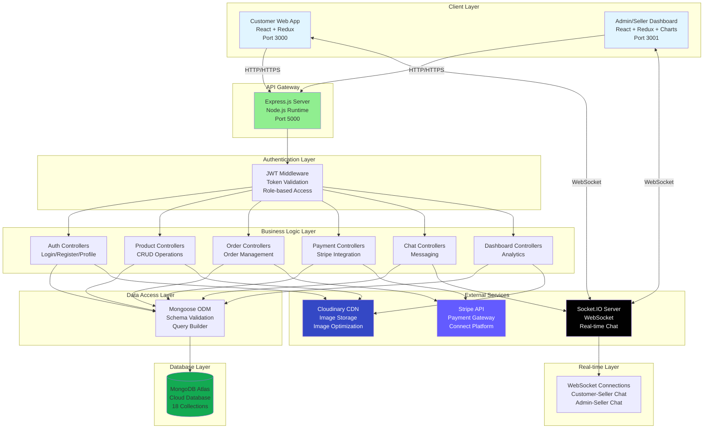

---

## Detailed Component Architecture

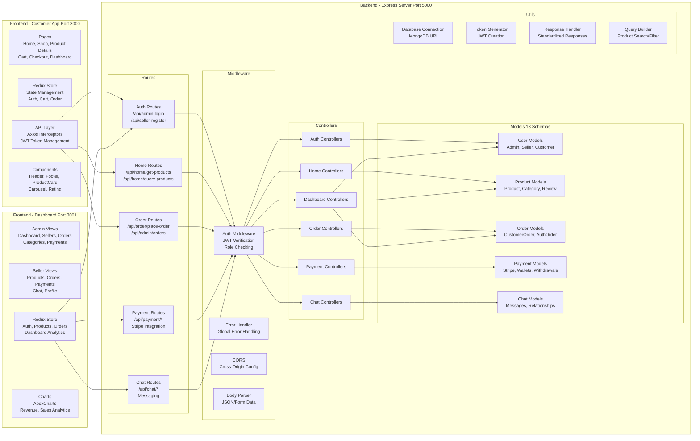

---

## Data Flow Architecture

### 1. Authentication Data Flow

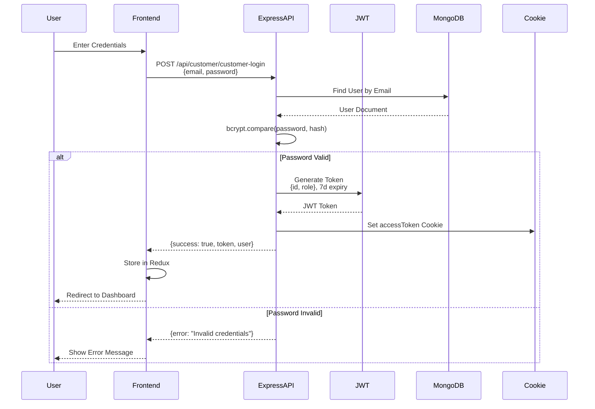

### 2. Product Search & Discovery Data Flow

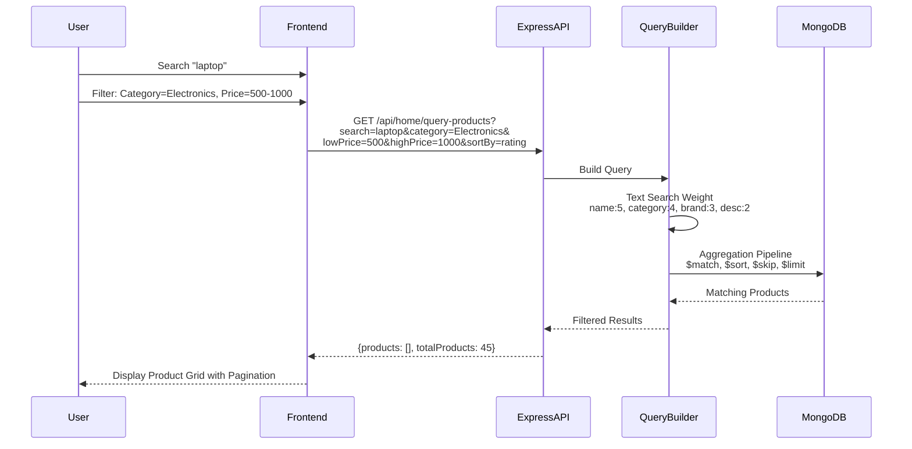

### 3. Order Placement & Payment Data Flow

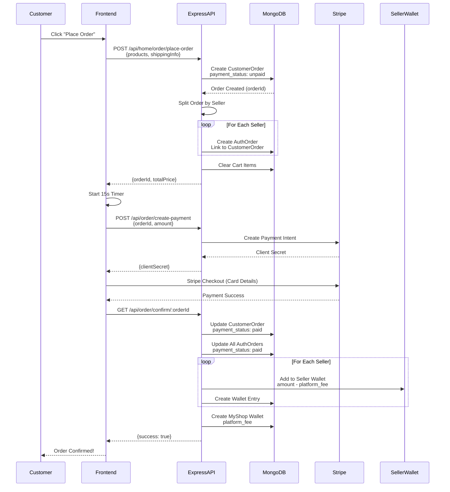

### 4. Real-time Chat Data Flow

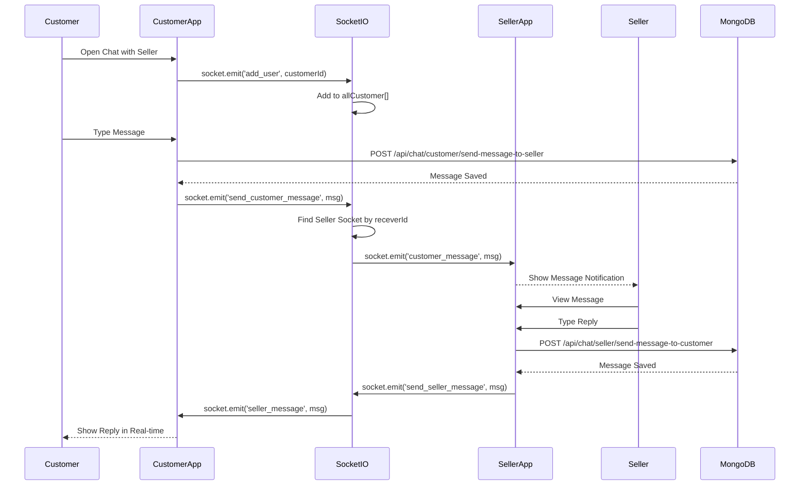

---

## Technology Stack Layers

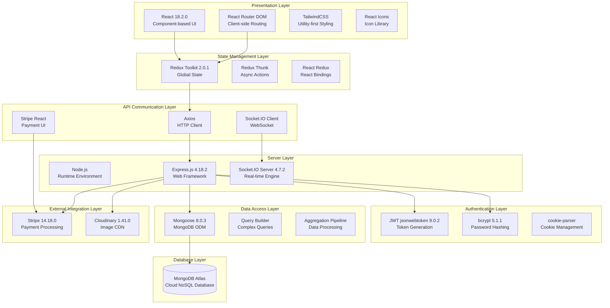

---

## Deployment Architecture

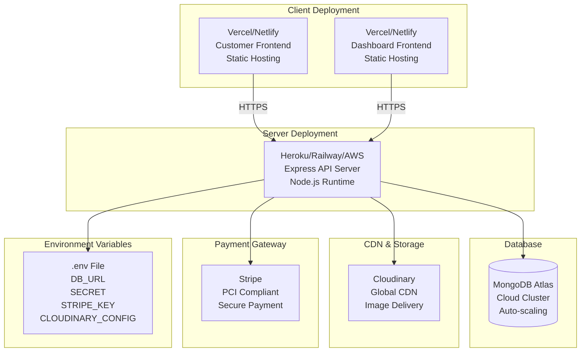

---

## Security Architecture

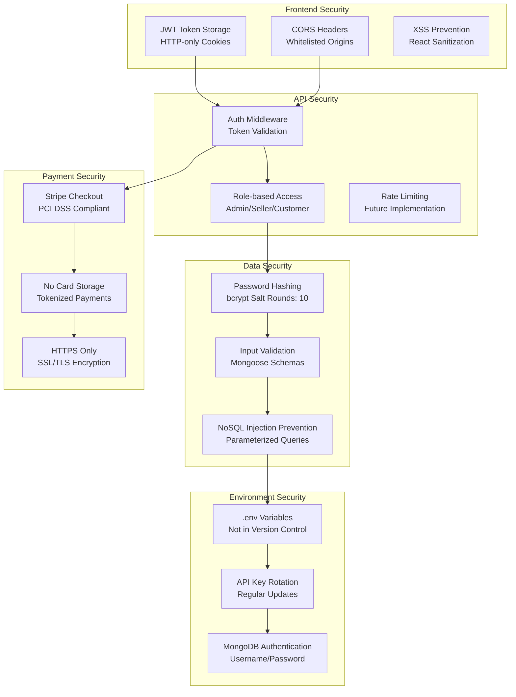

---

## File Upload Architecture

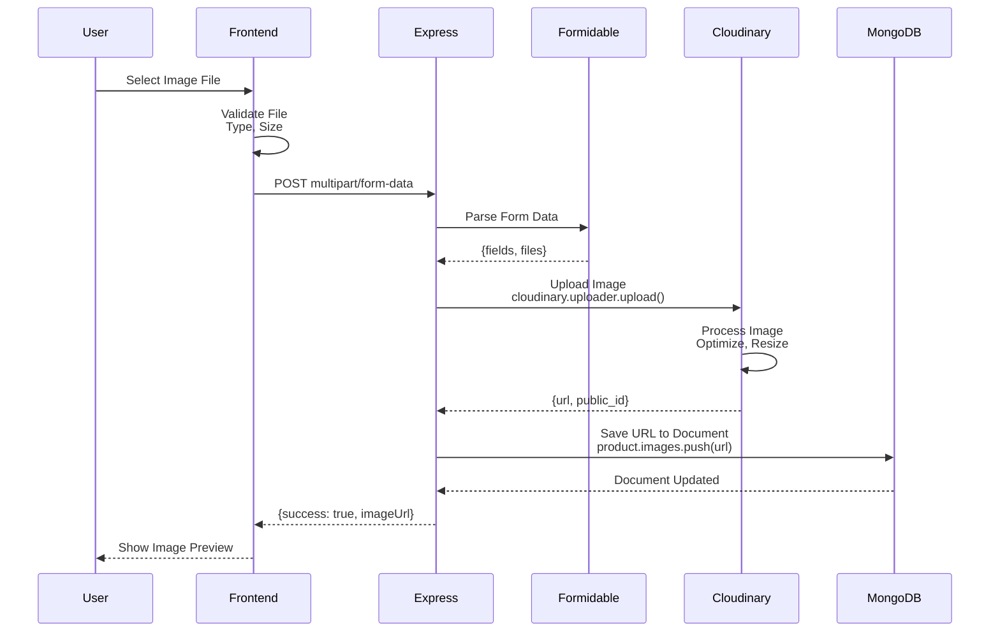

---

## Scaling Considerations

### Horizontal Scaling
```
┌─────────────┐
│ Load Balancer│
└──────┬──────┘
       │
   ┌───┴───┬────────┬────────┐
   │       │        │        │
┌──▼──┐ ┌──▼──┐ ┌──▼──┐ ┌──▼──┐
│API 1│ │API 2│ │API 3│ │API 4│
└──┬──┘ └──┬──┘ └──┬──┘ └──┬──┘
   │       │        │        │
   └───┬───┴────────┴────────┘
       │
   ┌───▼────────────────┐
   │ MongoDB Cluster    │
   │ (Replica Set)      │
   └────────────────────┘
```

### Caching Layer (Future)
- Redis for session management
- Product cache for frequently accessed items
- API response caching

### CDN Strategy
- Cloudinary for image delivery (already implemented)
- Static asset CDN for frontend bundles
- Global edge locations for low latency

---

## Monitoring & Logging (Recommended)

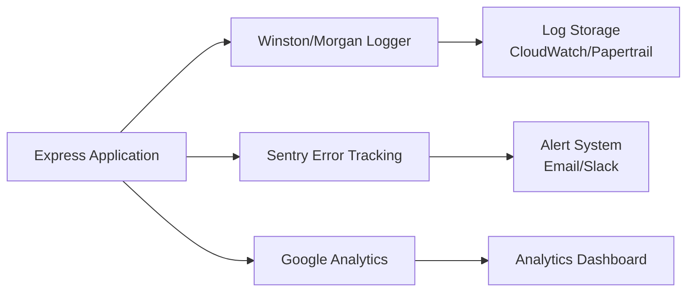

---

## Port Configuration

| Service | Port | URL |
|---------|------|-----|
| Customer Frontend | 3000 | http://localhost:3000 |
| Admin/Seller Dashboard | 3001 | http://localhost:3001 |
| Express API | 5000 | http://localhost:5000 |
| MongoDB | 27017 | mongodb+srv://... (Atlas Cloud) |
| Socket.IO | 5000 | ws://localhost:5000 (Same as API) |

---

## Environment Configuration

```
Backend (.env)
├── PORT=5000
├── DB_URL=mongodb+srv://...
├── SECRET=theDominators
├── STRIPE_SECRET_KEY=sk_test_...
├── cloud_name=dq0szn0al
├── api_key=386154179566863
├── api_secret=wgRgsA2bdUVv9fqAB_-07O6bey4
├── CLIENT_URL=http://localhost:3000
└── DASHBOARD_URL=http://localhost:3001

Frontend (React Environment)
├── REACT_APP_API_URL=http://localhost:5000
└── REACT_APP_STRIPE_PUBLIC_KEY=pk_test_...
```

---

## API Endpoint Categories

| Category | Endpoints | Protected | Main Purpose |
|----------|-----------|-----------|--------------|
| Auth | 8 | Mixed | Login, Register, Logout |
| Home/Products | 12 | No | Public product browsing |
| Cart/Wishlist | 8 | Yes | Shopping cart management |
| Orders | 15 | Yes | Order placement & tracking |
| Payment | 6 | Yes | Stripe integration |
| Dashboard | 8 | Yes | Analytics & stats |
| Chat | 8 | Yes | Real-time messaging |
| Category | 4 | Yes (Admin) | Category CRUD |
| Seller Mgmt | 6 | Yes (Admin) | Seller approval |

**Total API Endpoints: 50+**

---

**Generated for VendorVerse Final Semester Project Presentation**
