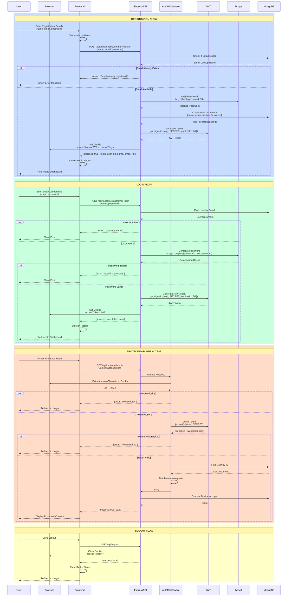
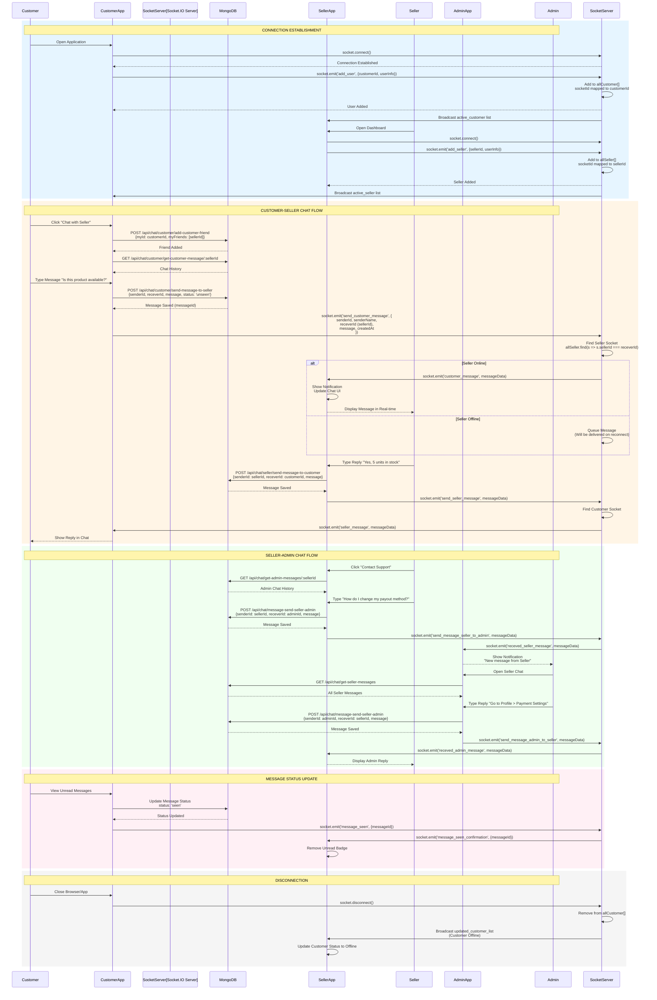
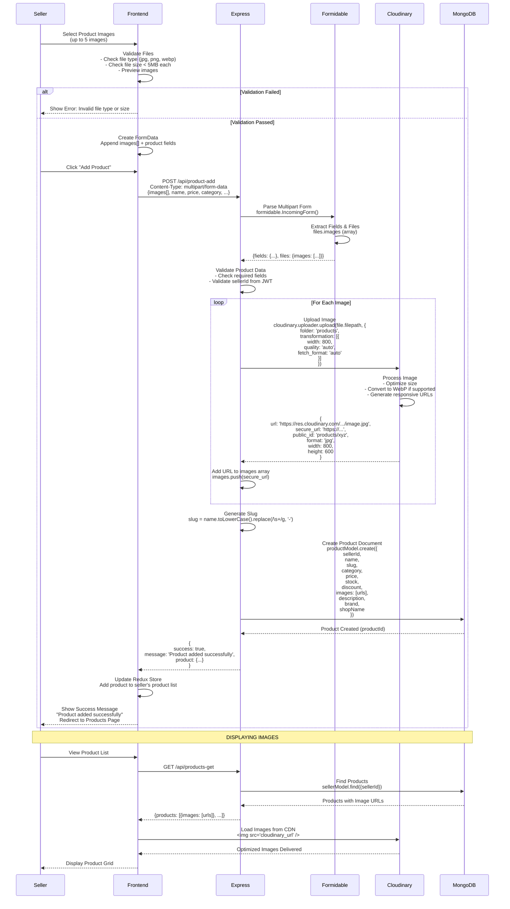
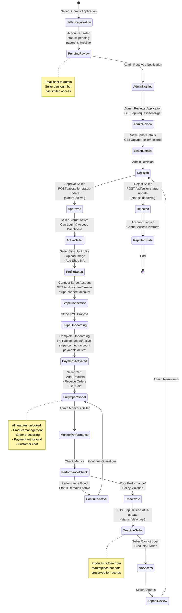

# VendorVerse - Technical Flow Diagrams

This document contains detailed technical flow diagrams for critical system processes.

---

## 1. AUTHENTICATION FLOW

### Complete Authentication Process



---

## 2. PAYMENT PROCESSING FLOW

### Complete Stripe Payment Integration

```mermaid
sequenceDiagram
    participant Customer
    participant Frontend
    participant ExpressAPI
    participant MongoDB
    participant Stripe
    participant SellerStripe[Seller Stripe Account]
    participant SellerWallet
    participant PlatformWallet

    rect rgb(230, 240, 255)
        Note over Customer,PlatformWallet: STRIPE CONNECT SETUP (Seller Onboarding)
        Customer->>Frontend: Seller Logs In
        Frontend->>ExpressAPI: GET /api/payment/create-stripe-connect-account
        ExpressAPI->>Stripe: Create Express Account<br/>stripe.accounts.create({type: 'express'})
        Stripe-->>ExpressAPI: {id: 'acct_xxx', ...}
        ExpressAPI->>Stripe: Create Account Link<br/>stripe.accountLinks.create({account, return_url})
        Stripe-->>ExpressAPI: {url: 'https://connect.stripe.com/...'}
        ExpressAPI->>MongoDB: Save Stripe Account<br/>stripeModel.create({sellerId, stripeId, code: uuid()})
        ExpressAPI-->>Frontend: {url, code}
        Frontend->>SellerStripe: Redirect to Stripe Onboarding
        SellerStripe-->>Frontend: Complete KYC & Banking Info
        Frontend->>ExpressAPI: PUT /api/payment/active-stripe-connect-account/:code
        ExpressAPI->>MongoDB: Update Seller<br/>payment: 'active'
        ExpressAPI-->>Frontend: {success: true}
        Frontend-->>Customer: Payment Setup Complete!
    end

    rect rgb(255, 240, 230)
        Note over Customer,PlatformWallet: CUSTOMER PAYMENT FLOW
        Customer->>Frontend: Click "Place Order"
        Frontend->>ExpressAPI: POST /api/home/order/place-order<br/>{products, shippingInfo}

        ExpressAPI->>MongoDB: Create CustomerOrder<br/>{customerId, products, price, payment_status: 'unpaid'}
        MongoDB-->>ExpressAPI: Order Created (orderId)

        ExpressAPI->>ExpressAPI: Split Order by Seller
        loop For Each Seller in Order
            ExpressAPI->>MongoDB: Create AuthOrder<br/>{orderId, sellerId, products, payment_status: 'unpaid'}
        end

        ExpressAPI->>MongoDB: Clear Cart
        ExpressAPI-->>Frontend: {orderId, totalPrice}

        Frontend->>Frontend: Start 15-second Timer
        Frontend-->>Customer: Show Payment Page

        Customer->>Frontend: Click "Pay Now"
        Frontend->>ExpressAPI: POST /api/order/create-payment<br/>{orderId, amount}

        ExpressAPI->>Stripe: Create Payment Intent<br/>stripe.paymentIntents.create({amount, currency})
        Stripe-->>ExpressAPI: {client_secret, id}
        ExpressAPI-->>Frontend: {clientSecret}

        Frontend->>Stripe: Load Stripe Checkout<br/>stripe.confirmCardPayment(clientSecret)
        Customer->>Stripe: Enter Card Details
        Stripe->>Stripe: Process Payment
        Stripe-->>Frontend: Payment Success

        Frontend->>ExpressAPI: GET /api/order/confirm/:orderId
    end

    rect rgb(230, 255, 230)
        Note over Customer,PlatformWallet: PAYMENT CONFIRMATION & DISTRIBUTION
        ExpressAPI->>MongoDB: Update CustomerOrder<br/>payment_status: 'paid'
        ExpressAPI->>MongoDB: Update All AuthOrders<br/>payment_status: 'paid'

        ExpressAPI->>ExpressAPI: Calculate Commissions
        loop For Each Seller in Order
            ExpressAPI->>ExpressAPI: sellerAmount = productTotal * 0.95<br/>platformFee = productTotal * 0.05
            ExpressAPI->>SellerWallet: Add Funds<br/>sellerWallet.create({sellerId, amount: sellerAmount, month, year})
            ExpressAPI->>PlatformWallet: Add Commission<br/>myShopWallet.create({amount: platformFee, month, year})
        end

        ExpressAPI-->>Frontend: {success: true, message: "Order confirmed"}
        Frontend-->>Customer: Order Success Page<br/>Show Order Tracking
    end

    rect rgb(255, 230, 255)
        Note over Customer,PlatformWallet: SELLER WITHDRAWAL FLOW
        Customer->>Frontend: Seller Views Wallet Balance
        Frontend->>ExpressAPI: GET /api/payment/seller-payment-details/:sellerId
        ExpressAPI->>SellerWallet: Aggregate Balance<br/>sellerWallet.aggregate([{$match}, {$group}])
        SellerWallet-->>ExpressAPI: {availableBalance, totalEarnings, pendingWithdrawals}
        ExpressAPI-->>Frontend: Payment Dashboard Data
        Frontend-->>Customer: Show Balance

        Customer->>Frontend: Request Withdrawal (Enter Amount)
        Frontend->>ExpressAPI: POST /api/payment/withdrowal-request<br/>{sellerId, amount}

        ExpressAPI->>SellerWallet: Check Available Balance
        alt Insufficient Balance
            ExpressAPI-->>Frontend: {error: "Insufficient balance"}
        else Sufficient Balance
            ExpressAPI->>MongoDB: Create Withdrawal Request<br/>{sellerId, amount, status: 'pending'}
            ExpressAPI->>SellerWallet: Deduct from Available Balance
            ExpressAPI-->>Frontend: {success: true}
            Frontend-->>Customer: Request Submitted
        end
    end

    rect rgb(255, 245, 230)
        Note over Customer,PlatformWallet: ADMIN WITHDRAWAL APPROVAL
        Customer->>Frontend: Admin Reviews Requests
        Frontend->>ExpressAPI: GET /api/payment/request
        ExpressAPI->>MongoDB: Find Pending Withdrawals<br/>withdrowRequest.find({status: 'pending'})
        MongoDB-->>ExpressAPI: Pending Requests
        ExpressAPI-->>Frontend: Withdrawal List

        Customer->>Frontend: Approve Withdrawal
        Frontend->>ExpressAPI: POST /api/payment/request-confirm<br/>{withdrawId}

        ExpressAPI->>MongoDB: Get Seller Stripe Account<br/>stripeModel.findOne({sellerId})
        MongoDB-->>ExpressAPI: {stripeId}

        ExpressAPI->>Stripe: Create Transfer<br/>stripe.transfers.create({amount, destination: stripeId})
        Stripe-->>SellerStripe: Transfer Funds
        SellerStripe-->>Customer: Funds Available in Bank

        ExpressAPI->>MongoDB: Update Withdrawal<br/>status: 'approved'
        ExpressAPI-->>Frontend: {success: true}
        Frontend-->>Customer: Withdrawal Approved
    end
```



---

## 3. ORDER MANAGEMENT FLOW

### Order Placement, Splitting, and Tracking

```mermaid
flowchart TD
    Start([Customer Ready to Checkout]) --> ViewCart[View Shopping Cart<br/>Multiple Sellers' Products]

    ViewCart --> CartItems{Cart Items?}
    CartItems -->|Empty| EmptyCart[Show Empty Cart Message]
    CartItems -->|Has Items| ProceedCheckout[Click Proceed to Checkout]

    ProceedCheckout --> ShippingForm[Enter Shipping Information<br/>- Name, Phone<br/>- Address, City, State<br/>- Postal Code]

    ShippingForm --> ValidateShipping{Valid Shipping Info?}
    ValidateShipping -->|No| ShippingForm
    ValidateShipping -->|Yes| PlaceOrderAPI[POST /api/home/order/place-order]

    PlaceOrderAPI --> CreateMainOrder[Create CustomerOrder<br/>customerId, products[], price<br/>payment_status: unpaid<br/>delivery_status: pending]

    CreateMainOrder --> GroupBySeller[Group Products by Seller]

    GroupBySeller --> SellerLoop{For Each Seller}

    SellerLoop --> CreateAuthOrder[Create AuthOrder<br/>orderId link to CustomerOrder<br/>sellerId<br/>seller's products only<br/>seller's total price<br/>payment_status: unpaid]

    CreateAuthOrder --> MoreSellers{More Sellers?}
    MoreSellers -->|Yes| SellerLoop
    MoreSellers -->|No| ClearCart[Delete All Cart Items<br/>DELETE cart where userId]

    ClearCart --> StartTimer[Start 15-Second Payment Timer]

    StartTimer --> ReturnOrderId[Return orderId to Frontend]

    ReturnOrderId --> ShowPayment[Show Payment Page<br/>Display Total Amount]

    ShowPayment --> UserAction{User Action}

    UserAction -->|Waits 15s| AutoCancel[Auto-Cancel Order<br/>Update status: cancelled]
    UserAction -->|Clicks Pay| StripeCheckout[Redirect to Stripe Checkout<br/>POST /api/order/create-payment]

    StripeCheckout --> CreatePaymentIntent[Stripe Creates Payment Intent<br/>Return clientSecret]

    CreatePaymentIntent --> CustomerPays[Customer Enters Card Details<br/>Stripe Processes Payment]

    CustomerPays --> PaymentResult{Payment Status}

    PaymentResult -->|Failed| PaymentFailed[Payment Failed<br/>Order Remains Unpaid<br/>Show Error Message]
    PaymentResult -->|Success| ConfirmOrder[GET /api/order/confirm/:orderId]

    ConfirmOrder --> UpdateMainOrder[Update CustomerOrder<br/>payment_status: paid]

    UpdateMainOrder --> UpdateAuthOrders[Update All Linked AuthOrders<br/>payment_status: paid]

    UpdateAuthOrders --> DistributeFunds[Distribute Funds to Wallets]

    DistributeFunds --> SellerWalletLoop{For Each Seller}

    SellerWalletLoop --> CalcCommission[Calculate:<br/>sellerAmount = total * 0.95<br/>platformFee = total * 0.05]

    CalcCommission --> AddSellerWallet[Add to SellerWallet<br/>sellerId, amount, month, year]

    AddSellerWallet --> AddPlatformWallet[Add to MyShopWallet<br/>platformFee, month, year]

    AddPlatformWallet --> MoreSellersWallet{More Sellers?}
    MoreSellersWallet -->|Yes| SellerWalletLoop
    MoreSellersWallet -->|No| OrderComplete[Order Confirmed<br/>Show Success Page]

    OrderComplete --> CustomerDashboard[Customer Can Track Order<br/>in Dashboard]

    CustomerDashboard --> SellerNotified[Sellers Notified<br/>New Order Received]

    SellerNotified --> SellerProcessing{Seller Action}

    SellerProcessing --> UpdateStatus1[Update Status: Processing<br/>PUT /api/seller/order-status/update]
    UpdateStatus1 --> UpdateStatus2[Update Status: Shipped]
    UpdateStatus2 --> UpdateStatus3[Update Status: Delivered]

    UpdateStatus3 --> CustomerNotified[Customer Receives Notifications<br/>at Each Status Change]

    CustomerNotified --> DeliveryComplete{Delivered?}

    DeliveryComplete -->|Yes| SubmitReview[Customer Can Submit Review<br/>POST /api/home/customer/submit-review]
    DeliveryComplete -->|No| WaitDelivery[Wait for Delivery]

    SubmitReview --> UpdateRating[Update Product Rating<br/>Calculate Average from All Reviews]

    UpdateRating --> End([Order Flow Complete])

    AutoCancel --> CancelNotify[Notify Customer<br/>Order Cancelled]
    PaymentFailed --> FailNotify[Notify Customer<br/>Payment Failed]

    EmptyCart --> EndEmpty([End])
    CancelNotify --> EndCancel([End - Order Cancelled])
    FailNotify --> EndFail([End - Payment Failed])
    WaitDelivery --> CustomerDashboard
```

---

## 4. REAL-TIME CHAT FLOW

### Socket.IO Communication Architecture



---

## 5. PRODUCT SEARCH & FILTER FLOW

### Advanced Search with Weighted Text Indexing

```mermaid
flowchart TD
    Start([Customer Wants to Find Product]) --> SearchType{Search Type}

    SearchType -->|Text Search| TypeQuery[Customer Types: laptop]
    SearchType -->|Category Browse| SelectCategory[Select Category: Electronics]
    SearchType -->|Home Page| ViewFeatured[View Featured Products]

    TypeQuery --> BuildQuery1[Build Search Query<br/>$text: $search: laptop]
    SelectCategory --> BuildQuery2[Build Category Filter<br/>category: Electronics]

    BuildQuery1 --> AddFilters[Add Optional Filters]
    BuildQuery2 --> AddFilters

    AddFilters --> PriceFilter{Price Range?}
    PriceFilter -->|Yes| AddPrice[price: $gte: 500, $lte: 1000]
    PriceFilter -->|No| RatingFilter

    AddPrice --> RatingFilter{Min Rating?}
    RatingFilter -->|Yes| AddRating[rating: $gte: 4]
    RatingFilter -->|No| BrandFilter

    AddRating --> BrandFilter{Brand?}
    BrandFilter -->|Yes| AddBrand[brand: Dell]
    BrandFilter -->|No| SortOption

    AddBrand --> SortOption{Sort By?}

    SortOption -->|Latest| SortLatest[sort: createdAt: -1]
    SortOption -->|Price Low-High| SortPriceLow[sort: price: 1]
    SortOption -->|Price High-Low| SortPriceHigh[sort: price: -1]
    SortOption -->|Rating| SortRating[sort: rating: -1]
    SortOption -->|Default| NoSort[No Sort Applied]

    SortLatest --> Pagination
    SortPriceLow --> Pagination
    SortPriceHigh --> Pagination
    SortRating --> Pagination
    NoSort --> Pagination

    Pagination[Apply Pagination<br/>page=1, perPage=12] --> ExecuteQuery[Execute MongoDB Query<br/>GET /api/home/query-products]

    ExecuteQuery --> TextSearch{Has Text Search?}

    TextSearch -->|Yes| WeightedSearch[MongoDB Text Search<br/>Weighted Indexes:<br/>name: 5<br/>category: 4<br/>brand: 3<br/>description: 2]
    TextSearch -->|No| StandardQuery[Standard Find Query]

    WeightedSearch --> CalculateScore[Calculate Text Score<br/>score: $meta: textScore]
    CalculateScore --> SortByScore[Sort by Score Desc]
    SortByScore --> ApplyOtherFilters

    StandardQuery --> ApplyOtherFilters[Apply Price, Rating, Brand Filters]

    ApplyOtherFilters --> CountTotal[Count Total Matching Products]

    CountTotal --> ApplyPagination[Apply Skip & Limit<br/>skip: page-1 * perPage<br/>limit: perPage]

    ApplyPagination --> SelectFields[Select Required Fields<br/>name, slug, price, images<br/>rating, discount, shopName]

    SelectFields --> ReturnResults[Return Results<br/>products: []<br/>totalProducts: count<br/>perPage: 12<br/>totalPages: ceil count/perPage]

    ReturnResults --> DisplayResults[Display Product Grid]

    DisplayResults --> UserAction{User Action}

    UserAction -->|Change Page| UpdatePage[page=2]
    UpdatePage --> Pagination

    UserAction -->|Change Filter| UpdateFilter[Update Filter Parameters]
    UpdateFilter --> AddFilters

    UserAction -->|Clear Filters| ClearAll[Reset All Filters]
    ClearAll --> SearchType

    UserAction -->|Select Product| ViewProductDetail[View Product Details<br/>GET /api/home/product-details/:slug]

    ViewProductDetail --> End([End])

    ViewFeatured --> GetFeatured[GET /api/home/get-products<br/>Get Latest/Featured/Discounted]
    GetFeatured --> DisplayResults
```

---

## 6. IMAGE UPLOAD FLOW

### Cloudinary Integration Process



---

## 7. SELLER APPROVAL WORKFLOW

### Admin Vendor Management Process



---

## How to Use These Diagrams

### For Presentation
1. **Render Diagrams**: Use https://mermaid.live/ to convert to images
2. **Export Options**: PNG (high resolution) or SVG (scalable)
3. **Slide Integration**: One diagram per slide with explanatory notes
4. **Highlight Key Points**: Use annotations to emphasize critical steps

### For Documentation
1. **GitHub**: Automatically renders Mermaid diagrams
2. **VS Code**: Install Mermaid extension for preview
3. **Confluence/Notion**: Most platforms support Mermaid syntax

### For Understanding
1. **Follow the Flow**: Read from top to bottom or left to right
2. **Identify Decision Points**: Diamond shapes indicate branching logic
3. **Track Data Flow**: Arrows show direction of information
4. **Note Interactions**: Sequence diagrams show system communication

---

**Generated for VendorVerse Final Semester Project Presentation**
